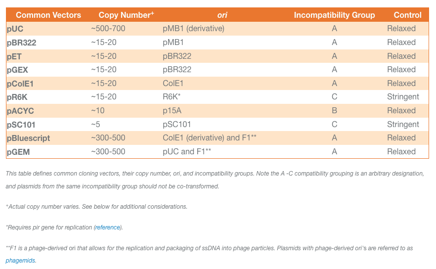

# MIT BioMaker Space Plasmid Library

## Golden Gate
- References
  - [Addgene: Marillonnet MoClo](https://www.addgene.org/kits/marillonnet-moclo/#kit-contents)
  - [(Marillonnet, 2011)](https://journals.plos.org/plosone/article?id=10.1371/journal.pone.0016765)
  - [Fast track assembly of multigene constructs using Golden Gate cloning and the MoClo system](https://www.tandfonline.com/doi/full/10.4161/bbug.3.1.18223)
  - [Synthetic DNA Assembly Using Golden Gate Cloning and the Hierarchical Modular Cloning Pipeline (Marillonnet, 2020)](https://currentprotocols.onlinelibrary.wiley.com/doi/full/10.1002/cpmb.115)

